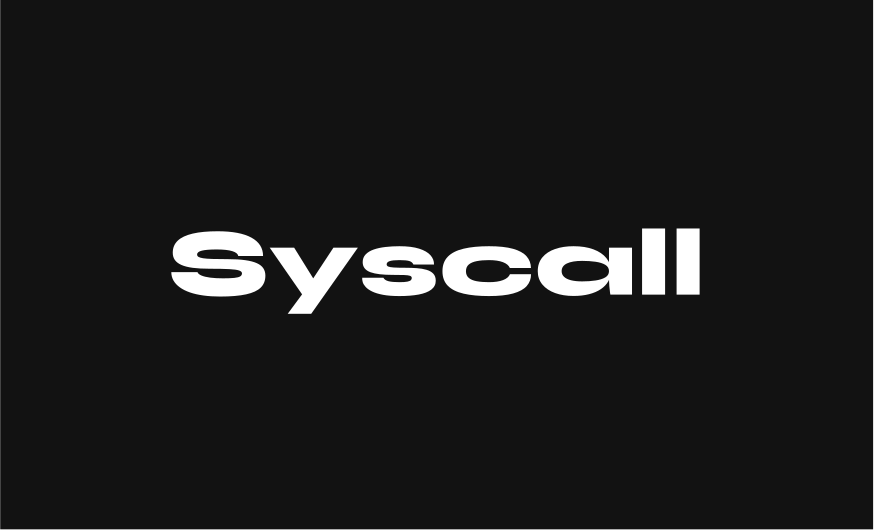

# Syscall Programming Language

Syscall is a high-level, cross-platform programming language designed with the spirit of assembly language for experimental purposes.



## Features

- **Assembly-like Syntax:** Syscall provides a syntax that resembles traditional assembly languages, making it suitable for low-level programming enthusiasts.
  
- **Cross-Platform:** Designed to work across different platforms and architectures, enabling flexibility in development and deployment.
  
- **High-Level Abstractions:** While inspired by assembly, Syscall offers high-level abstractions to simplify complex tasks and enhance productivity.
  
- **LLVM Backend:** Utilizes LLVM as the backend for efficient code generation and optimization, ensuring performance and portability.

## Example
```assembly
; Example program in Syscall
main
    add 1 2         ; Perform addition
    num add         ; assigning add functions result to num named variable
return num          ; Return the result

@print
    log num         ; Ready to print the result
return log          ; Return log call for printing
```
## Getting Started
To start using Syscall, follow these steps:

- **Installation:** Clone the repository and install the necessary dependencies.

- **Build:** Use the provided build system to compile Syscall programs.

- **Run:** Execute your Syscall programs on your preferred platform.

## Contributing
Contributions are welcome! If you find any issues or have ideas for improvements, please submit an issue or a pull request.

## License
This project is licensed under the GNU General Public License v3.0 - see the LICENSE file for details